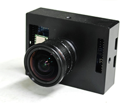

.. _index:

欢迎来到天眸视觉(TianMouCV)的项目主页
########################################################################################

* :ref:`Homepage in English <index_en>`

**其他资源**

`Tianmouc 开源代码计划 <https://github.com/Tianmouc>`_

`Tianmouc 镜头选型工具 <https://lyh983012.github.io/depth-of-field/>`_

借鉴人类视觉中双通路感知的基本原理，清华大学类脑计算研究中心发展了新一代异构互补融合的双通路类脑视觉感知芯片架构：天眸芯 (Tianmouc) 。

    
Tianmouc是世界首款多通路类脑视觉传感器，又称互补视觉传感器(CVS)，使用单个芯片即可灵活实现高速（10,000fps）、高动态（130dB）、高灵敏度（72%@530nm，NIR）、高精度（10bit）与低功耗、低带宽（相较于传统高速相机，具有90%带宽下降）的视觉感知，综合指标（FoM）位列世界一流。

DEMO视频示例
-------------------------

.. raw:: html

   <video width="640" height="360" controls>
     <source src="_static/demo_compressed.mp4" type="video/mp4">
     Your browser does not support the video tag.
   </video>

.. toctree::
    :maxdepth: 1
    :caption: Outline

    /tianmoucv/introduction

    
   
下载资料
-------------------------

1. 算法代码
================

Nature论文中使用的代码
^^^^^^^^^^^^^^^^^^^^^^^^^^^^^^^^^^^^^^^^^^

可以从github中获取

.. code:: bash

    git clone https://github.com/Tianmouc/tianmouc_paper_code.git

Python视觉工具包TianmoucV
^^^^^^^^^^^^^^^^^^^^^^^^^^^^^^^^^^^^^^^^^^

公开版本为0.3.2，开发版本测试中

.. code:: bash

    conda create -n tianmoucv --python=3.10
    conda activate tianmoucv
    conda install pytorch torchvision torchaudio pytorch-cuda=12.0 -c pytorch -c nvidia
    pip install tianmoucv -i https://pypi.tuna.tsinghua.edu.cn/simple

TianmoucV文档见 :doc:`/tianmoucv/introduction`，安装中遇到的问题以及可能需要的资料请查阅 :doc:`/QA/introduction` 

2. 数据集
================

usb模组测试数据
^^^^^^^^^^^^^^^^^^^^^^^^^^^^^^^^^^^^^^^^^^

- `USB模组的样例数据下载 <https://cloud.tsinghua.edu.cn/f/dc0d394efcb44af3b9b3/?dl=1>`_

你可以使用 tianmoucv/exmaple/data/test_data_read.ipynb 尝试这段数据

更多的数据集将在将来发布

Nature论文中使用的部分数据
^^^^^^^^^^^^^^^^^^^^^^^^^^^^^^^^^^^^^^^^^^

你可以从 `Zendo <https://doi.org/10.5281/zenodo.10602822>`_ 中下载我们的数据

解压数据后，使用软连接将数据连接到代码中的data文件夹

.. code-block:: bash

    cd [N_pub_code]
    ln -s [your dataset path] data

引用和出版物
-------------------------
如果您在自己的工作中用到了天眸视觉算法库(Tianmoucv)，您可以按照下列格式进行引用：

.. code-block::

    @misc{Tianmouc}

其中的 `YYYY-MM-DD` 需要更改为您的工作使用的天眸视觉算法库(Tianmoucv)版本对应的最后一次代码修改日期。

文档索引
-------------------------

* :ref:`genindex`
* :ref:`modindex`
* :ref:`search`

开源软件项目作者信息
----------------------------------

`Yihan Lin 林逸晗 <https://lyh983012.github.io>`_ For GUI/SDK/ISP-Algorithms/Data/Maintainace

|
|
|
|
|
|
|

.. _index_en:

Welcome to TianMouC's project homepage!
########################################################################################

**Other Resources**

`Tianmouc Open Source <https://github.com/Tianmouc>`_

`Tianmouc Lens Selection Tool <https://lyh983012.github.io/depth-of-field/>`_

Based on the basic principle of dual-pathway perception in human vision, CBICR at Tsinghua University has developed a new generation of heterogeneous complementary dual-pathway vision chip architecture: Tianmouc.

    
Tianmouc is the world's first multi-pathway brain-inspired vision sensor, also known as Complementary Vision Sensor (CVS), which realizes high speed (10,000fps), high dynamics (130dB), high sensitivity (72%@530nm, NIR), and high accuracy (10 bit) with low power consumption and low bandwidth (90% bandwidth degradation compared to traditional high-speed cameras) for visual perception, and the comprehensive perfoermance (FoM) is SOTA in the world.

* :ref:`Homepage in English <index_en>`

    
DEMO video
----------------------------------------------------------------------------------------------------

.. raw:: html

   <video width="640" height="360" controls>
     <source src="_static/demo_compressed.mp4" type="video/mp4">
     Your browser does not support the video tag.
   </video>

   
Download contents
----------------------------------------------------------------------------------------------------

1. Algorithms Codes
================================================================

Code used in the main paper 
^^^^^^^^^^^^^^^^^^^^^^^^^^^^^^^^^^^^^^^^^^^^^^^^^^^^^^^^^^^^^^^^^^^^^^^^^^^^^^^^^^^^

available in github repo

.. code:: bash

    git clone https://github.com/Tianmouc/tianmouc_paper_code.git

Python Visualization Toolkit: TianmoucV
^^^^^^^^^^^^^^^^^^^^^^^^^^^^^^^^^^^^^^^^^^^^^^^^^^^^^^^^^^^^^^^^^^^^^^^^^^^^^^^^^^^^

Public version is 0.3.2, development version in testing

.. code:: bash

    conda create -n tianmoucv --python=3.10
    conda activate tianmoucv
    conda install pytorch torchvision torchaudio pytorch-cuda=12.0 -c pytorch -c nvidia
    pip install tianmoucv -i https://pypi.tuna.tsinghua.edu.cn/simple

Documents can be found at :doc:`/tianmoucv/introduction`，Problems encountered during installation and information that may be required can be found at :doc:`/QA/introduction` 

2. Dataset
========================================

USB module test data
^^^^^^^^^^^^^^^^^^^^^^^^^^^^^^^^^^^^^^^^^^^^^^^^^^^^^^^^^^^^^^^^^^^^^^^^^^^^^^^^^^^^

- `DEMO data <https://cloud.tsinghua.edu.cn/f/dc0d394efcb44af3b9b3/?dl=1>`_

You can try this data using tianmoucv/exmaple/data/test_data_read.ipynb

More datasets will be released in the future

Some of the data used in the Nature paper
^^^^^^^^^^^^^^^^^^^^^^^^^^^^^^^^^^^^^^^^^^^^^^^^^^^^^^^^^^^^^^^^^^^^^^^^^^^^^^^^^^^^^^^^^^^^^^^^^^^^^^

You can found the demo data in `Zendo <https://doi.org/10.5281/zenodo.10602822>`_ 

After unzipping the data, use a soft link to connect the data to the data folder in the code

.. code-block:: bash

    cd [N_pub_code]
    ln -s [your dataset path] data

Citations and Publications
---------------------------------------------------------------------------
If you have used the Tianmoucv Visual Algorithm Library (Tianmoucv) in your own work, you may cite it in the following format:

.. code-block::

    @misc{Tianmouc}

where `YYYY-MM-DD` needs to be changed to the date of the last code modification corresponding to the version of Tianmoucv used in your work.

Document Index
---------------------------------------------------------------------------

* :ref:`genindex`
* :ref:`modindex`
* :ref:`search`

Open source software project author information
------------------------------------------------------------------------------------------------------

`Yihan Lin 林逸晗 <https://lyh983012.github.io>`_ For GUI/SDK/ISP-Algorithms/Data/Maintainace