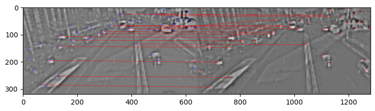
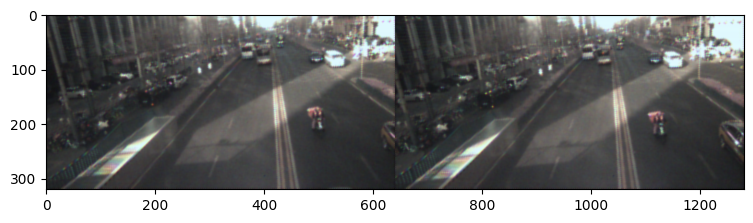
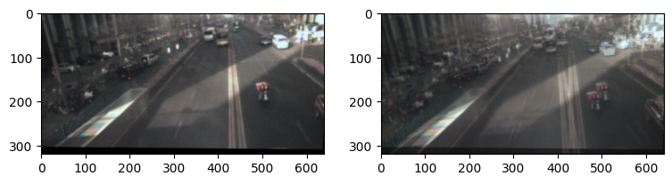

Haris角点和SIFT特征描述符
=========================

这个示例展示一个在AOP上运行的，特征点检测和匹配算法，RGB上的数据用于验证
------------------------------------------------------------------------

调用接口： - tianmoucv.proc.features.(HarrisCorner,sift,hog) -
tianmoucv.proc.tracking.(feature_matching,mini_l2_cost_matching,align_images)

.. code:: ipython3

    %load_ext autoreload

必要的包
--------

.. code:: ipython3

    %autoreload
    import sys,os
    import torch
    import numpy as np
    import matplotlib.pyplot as plt
    import torch
    import torch.nn.functional as F
    import matplotlib.pyplot as plt
    
    from tianmoucv.isp import lyncam_raw_comp,demosaicing_npy,SD2XY
    from tianmoucv.proc.features import HarrisCorner,sift,hog
    from tianmoucv.proc.tracking import feature_matching,mini_l2_cost_matching,align_images
    import cv2
    from tianmoucv.data import TianmoucDataReader
    

.. parsed-literal::

    TianMouCV™ 0.3.5.5, via Y. Lin  update exaple and fix dynamo optimization bug

准备数据
--------

.. code:: ipython3

    train='/data/lyh/tianmoucData/tianmoucReconDataset/train/'
    dirlist = os.listdir(train)
    traindata = [train + e for e in dirlist]
    
    val='/data/lyh/tianmoucData/tianmoucReconDataset/test/'
    vallist = os.listdir(val)
    valdata = [val + e for e in vallist]
    key_list = []
    print('---------------------------------------------------')
    for sampleset in traindata:
        print('---->',sampleset,'有：',len(os.listdir(sampleset)),'个样本')
        for e in os.listdir(sampleset):
            print(e,end=" ")
            key_list.append(e)
    print('---------------------------------------------------')
    for sampleset in valdata:
        print('---->',sampleset,'有：',len(os.listdir(sampleset)),'个样本')
        for e in os.listdir(sampleset):
            print(e,end=" ")
            key_list.append(e)
            
    all_data = valdata + traindata
    key_list = ['underbridge_hdr_4']

.. parsed-literal::

    ---------------------------------------------------
    ----> /data/lyh/tianmoucData/tianmoucReconDataset/train/normal 有： 67 个样本
    outdoor_cross_8 train_cross2 traffic5 indoor_office_2 train_indoor_dog4 outdoor_cross_5 indoor_office_6 train_running_man_5 indoor_office_1 train_exam_fan2 indoor_office_3 people1 train_exam_fan5 indoor_office_4 indoor_slefie_2 outdoor_cross_9 outdoor_bridge_1 outdoor_cross_4 outdoor_cross_1 outdoor_4huan traffic15 outdoor_cross_12 outdoor_bridge_2 traffic9 traffic2 traffic_nohdr_16 traffic11 train_exam_fan1 train_indoor_dog1 train_cross3 train_driving5 traffic7 traffic_nohdr_15 train_driving14 train_driving9 outdoor_cross_7 train_driving4 traffic10 train_running_man_6 train_exam_fan3 train_driving6 train_cross4 train_driving3 outdoor_cross_3 train_driving11 traffic14 outdoor_bz_1 outdoor_hutong_1 indoor_slefie_1 indoor_keyboard1 train_man_play_ball1 train_driving8 traffic3 train_driving7 outdoor_cross_11 train_exam_full4 train_running_man_7 people10 traffic6 train_driving13 traffic13 traffic_nohdr_17 train_driving10 train_exam_full2 train_indoor_dog2 traffic1 train_exam_full1 ----> /data/lyh/tianmoucData/tianmoucReconDataset/train/extreme 有： 51 个样本
    flicker_12 underbridge_hdr_4 hdr_people9 train_exam_flicker3 underbridge_hdr_2 hdr_traffic35 hdr_people15 flicker_3 hdr_people2 train_tunnel3_hdr_ae hdr_traffic18 shake2 indoor_crazy_shake flicker_1 flicker_8 hdr_traffic20 underbridge_hdr_1 hdr_traffic30 train_exam_flicker2 hdr_traffic19 flicker_17 flicker_6 shake5 hdr_traffic23 train_exam_flicker1 train_hdr_human hdr_people5 hdr_people3 flicker_0 hdr_people11 train_tunnel6_hdr_ae flicker_4 flicker_9 flicker_11 flicker_15 hdr_people7 shake4 hdr_traffic26 train_tunnel4_hdr_ae hdr_traffic25 hdr_traffic29 train_tunnel1_hdr_blur shake1 train_driving2 hdr_traffic22 train_exam_fan_QRcode_1 hdr_people6 flicker_14 hdr_traffic34 hdr_people14 train_tunnel5_hdr_ae ---------------------------------------------------
    ----> /data/lyh/tianmoucData/tianmoucReconDataset/test/normal 有： 24 个样本
    test_tunnel2 test_man_play_ball3 test_exam_fan4 test_driving24 test_driving3 test_driving20 indoor_office_5 outdoor_cross_10 test_running_man_8 test_cross3 outdoor_cross_13 outdoor_4huan_2 test_exam_full3 test_driving4 traffic4 test_driving12 test_driving16 outdoor_cross_6 traffic8 test_driving8 traffic12 outdoor_bridge_3 test_running_man_4 indoor_keyboard2 ----> /data/lyh/tianmoucData/tianmoucReconDataset/test/extreme 有： 30 个样本
    shake3 test_tunnel7_hdr_ae hdr_traffic36 test_exam_fan_QRcode_2 flicker_16 hdr_traffic21 hdr_traffic32 test_indoor_dog3 hdr_traffic24 train_exam_flicker5 hdr_people13 test_tunnel8_hdr_ae_double hdr_people8 flicker_13 hdr_traffic33 hdr_people4 test_exam_fan_QRcode_3 hdr_traffic31 indoor_selfie_shake_3 flicker_7 hdr_people16 flicker_10 flicker_2 hdr_people12 test_driving_night_light1 test_hdr_human2 underbridge_hdr_3 flicker_18 flicker_5 shake6 

.. code:: ipython3

    %autoreload
    import time
    from tianmoucv.proc.reconstruct import laplacian_blending
    from IPython.display import clear_output
    
    key= 'outdoor_bridge_3'
    dataset = TianmoucDataReader(all_data,MAXLEN=500*1,matchkey=key,speedUpRate=1)
    
    imlist = []
    for sampleid in range(len(dataset)):
        if sampleid<95:
            continue
        if sampleid>99:
            break
        else:
            ###############################
            sample = dataset[sampleid]
            F1 = sample['F0']
            tsdiff = sample['rawDiff']/255.0
            threshed_tsdiff = tsdiff[:,0,...].permute(1,2,0)
            SD = threshed_tsdiff[...,1:]
            TD = threshed_tsdiff[...,0]
            Ix1,Iy1= SD2XY(SD)
            gray = laplacian_blending(-Ix1,-Iy1,iteration=20)
            gray_laplac1 = F.interpolate(torch.Tensor(gray).unsqueeze(0).unsqueeze(0), size=(320,640), mode='bilinear').squeeze(0).squeeze(0)
    
            # 选择5帧后的数据做匹配验证
            sample = dataset[sampleid+5]
            F2 = sample['F0']
            tsdiff = sample['rawDiff']/255.0
            threshed_tsdiff = tsdiff[:,0,...].permute(1,2,0)
            SD = threshed_tsdiff[...,1:]
            TD = threshed_tsdiff[...,0]
            Ix2,Iy2= SD2XY(SD)
            gray = laplacian_blending(-Ix2,-Iy2,iteration=20)
            gray_laplac2 = F.interpolate(torch.Tensor(gray).unsqueeze(0).unsqueeze(0), size=(320,640), mode='bilinear').squeeze(0).squeeze(0)
    
            gray_laplac1 = (gray_laplac1 - torch.min(gray_laplac1)) / (torch.max(gray_laplac1) - torch.min(gray_laplac1) + 1e-3) 
            gray_laplac2 = (gray_laplac2 - torch.min(gray_laplac2)) / (torch.max(gray_laplac2) - torch.min(gray_laplac2) + 1e-3) 
            
            F1_g = torch.stack([gray_laplac1]*3,dim=-1)
            F2_g = torch.stack([gray_laplac2]*3,dim=-1)
    
            ## 计算harris角点
            featureList1 = []
            kp1=[]
            featureList2 = []
            kp2=[]
            k = 0.01
            th = 0.01
            nmsSize= 15
            startT = time.time()
            idmap,R = HarrisCorner(Ix1,Iy1,k=k,th=th,nmsSize=nmsSize)
            endT = time.time()
            idmap2,R = HarrisCorner(Ix2,Iy2,k=k,th=th,nmsSize=nmsSize)
            print('corner detect cost:',endT-startT)
    
            canvas_rgb = np.zeros([320,1280,3])
            canvas_rgb[:,:640,:] = F1
            canvas_rgb[:,640:,:] = F2
            
            canvas = np.zeros([320,1280,3])
            canvas[:,:640,:] = F1_g.numpy()
            canvas[:,640:,:] = F2_g.numpy()
            
            #(step1)第一张图的feature list
            for i in range(idmap.shape[0]):
                for j in range(idmap.shape[1]):
                    if idmap[i,j]>0:
                        cv2.circle(canvas,(j*2,i*2),4,(0,0,255))
                        kp1.append([i,j])
            #(step2)第二张图的feature list
            for i in range(idmap2.shape[0]):
                for j in range(idmap2.shape[1]):
                    if idmap2[i,j]>0:
                        cv2.circle(canvas,(j*2+640,i*2),4,(255,0,0))
                        kp2.append([i,j])
    
            #(step3)计算两张图对应fp list的特征描述子
            startT = time.time()
            kp1,featureList1 = sift(Ix1,Iy1,kp1)
            endT = time.time()
            print('feature extract cost:',endT-startT)
            kp2,featureList2 = sift(Ix2,Iy2,kp2) 
            print('good kp1/2:',len(kp1),len(kp2))
            #print('>>>>>KP1:',kp1)
            #print('>>>>>KP2:',kp2)
            #mapping to rgb coordinate
            kp1 = [ (p[0]*2,p[1]*2) for p in kp1 ]
            kp2 = [ (p[0]*2,p[1]*2) for p in kp2 ]
            fl1 = torch.stack(featureList1,dim=0).view(len(kp1),-1)
            fl2 = torch.stack(featureList2,dim=0).view(len(kp2),-1)
    
            #(step4)匹配特征
            matches = feature_matching(fl1, fl2, ratio=0.75)
            #matches = mini_l2_cost_matching(fl1, fl2)
            print('matched kp:',len(matches))
            canvas_wp, H = align_images(F1.copy(),kp1, kp2, matches, canvas) 
    
            clear_output()
            plt.figure(figsize=(9,3))
            plt.imshow(canvas)
            plt.show()
            imlist.append(canvas)
            
            plt.figure(figsize=(9,3))
            plt.imshow(canvas_rgb)
            plt.show()
    
            plt.figure(figsize=(9,3))
            plt.subplot(1,2,1)  
            plt.imshow(canvas_wp)
            plt.subplot(1,2,2)  
            plt.imshow((F2+canvas_wp)/2)
            plt.show()

.. parsed-literal::

    Clipping input data to the valid range for imshow with RGB data ([0..1] for floats or [0..255] for integers).

.. code:: ipython3

    from tianmoucv.algorithm import white_balance
    
    def images_to_video(frame_list,name,Val_size=(512,256),Flip=False):
        fps = 30     
        size = (Val_size[0], Val_size[1]*2) # 需要转为视频的图片的尺寸
        out = cv2.VideoWriter(name,0x7634706d , fps, size)
        for frame in frame_list:
            frame = (frame-np.min(frame))/(np.max(frame)-np.min(frame)) * 255
            frame2 = frame.astype(np.uint8)
            out.write(frame2)
        out.release()
        
    images_to_video(imlist,'./'+key+'.mp4',Val_size=(640,320),Flip=False)
