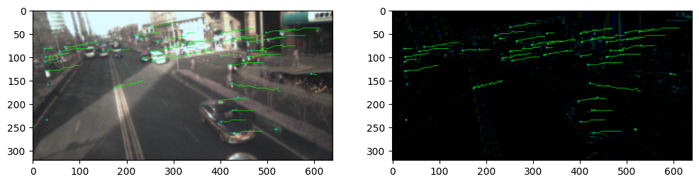

基于SD的特征追踪
================

这个示例展示一个在AOP上运行的特征点追踪算法
-------------------------------------------

调用接口： - tianmoucv.proc.features.(HarrisCorner,sift,hog) -
tianmoucv.proc.tracking.(feature_matching,mini_l2_cost_matching,align_images)

.. code:: ipython3

    %load_ext autoreload

必要的包
--------

.. code:: ipython3

    %autoreload
    import sys,os
    import torch
    import numpy as np
    import matplotlib.pyplot as plt
    import torch
    import torch.nn.functional as F
    import matplotlib.pyplot as plt
    
    from tianmoucv.isp import lyncam_raw_comp,demosaicing_npy,SD2XY
    from tianmoucv.proc.features import HarrisCorner,sift,hog
    from tianmoucv.proc.tracking import feature_matching,mini_l2_cost_matching,align_images
    import cv2
    from tianmoucv.data import TianmoucDataReader

.. parsed-literal::

    TianMouCV™ 0.3.5.5, via Y. Lin  update exaple and fix dynamo optimization bug

.. code:: ipython3

    train='/data/lyh/tianmoucData/tianmoucReconDataset/train/'
    dirlist = os.listdir(train)
    traindata = [train + e for e in dirlist]
    
    val='/data/lyh/tianmoucData/tianmoucReconDataset/test/'
    vallist = os.listdir(val)
    valdata = [val + e for e in vallist]
    key_list = []
    print('---------------------------------------------------')
    for sampleset in traindata:
        print('---->',sampleset,'有：',len(os.listdir(sampleset)),'个样本')
        for e in os.listdir(sampleset):
            print(e,end=" ")
            key_list.append(e)
    print('---------------------------------------------------')
    for sampleset in valdata:
        print('---->',sampleset,'有：',len(os.listdir(sampleset)),'个样本')
        for e in os.listdir(sampleset):
            print(e,end=" ")
            key_list.append(e)
            
    all_data = valdata + traindata

.. parsed-literal::

    ---------------------------------------------------
    ----> /data/lyh/tianmoucData/tianmoucReconDataset/train/normal 有： 67 个样本
    outdoor_cross_8 train_cross2 traffic5 indoor_office_2 train_indoor_dog4 outdoor_cross_5 indoor_office_6 train_running_man_5 indoor_office_1 train_exam_fan2 indoor_office_3 people1 train_exam_fan5 indoor_office_4 indoor_slefie_2 outdoor_cross_9 outdoor_bridge_1 outdoor_cross_4 outdoor_cross_1 outdoor_4huan traffic15 outdoor_cross_12 outdoor_bridge_2 traffic9 traffic2 traffic_nohdr_16 traffic11 train_exam_fan1 train_indoor_dog1 train_cross3 train_driving5 traffic7 traffic_nohdr_15 train_driving14 train_driving9 outdoor_cross_7 train_driving4 traffic10 train_running_man_6 train_exam_fan3 train_driving6 train_cross4 train_driving3 outdoor_cross_3 train_driving11 traffic14 outdoor_bz_1 outdoor_hutong_1 indoor_slefie_1 indoor_keyboard1 train_man_play_ball1 train_driving8 traffic3 train_driving7 outdoor_cross_11 train_exam_full4 train_running_man_7 people10 traffic6 train_driving13 traffic13 traffic_nohdr_17 train_driving10 train_exam_full2 train_indoor_dog2 traffic1 train_exam_full1 ----> /data/lyh/tianmoucData/tianmoucReconDataset/train/extreme 有： 51 个样本
    flicker_12 underbridge_hdr_4 hdr_people9 train_exam_flicker3 underbridge_hdr_2 hdr_traffic35 hdr_people15 flicker_3 hdr_people2 train_tunnel3_hdr_ae hdr_traffic18 shake2 indoor_crazy_shake flicker_1 flicker_8 hdr_traffic20 underbridge_hdr_1 hdr_traffic30 train_exam_flicker2 hdr_traffic19 flicker_17 flicker_6 shake5 hdr_traffic23 train_exam_flicker1 train_hdr_human hdr_people5 hdr_people3 flicker_0 hdr_people11 train_tunnel6_hdr_ae flicker_4 flicker_9 flicker_11 flicker_15 hdr_people7 shake4 hdr_traffic26 train_tunnel4_hdr_ae hdr_traffic25 hdr_traffic29 train_tunnel1_hdr_blur shake1 train_driving2 hdr_traffic22 train_exam_fan_QRcode_1 hdr_people6 flicker_14 hdr_traffic34 hdr_people14 train_tunnel5_hdr_ae ---------------------------------------------------
    ----> /data/lyh/tianmoucData/tianmoucReconDataset/test/normal 有： 24 个样本
    test_tunnel2 test_man_play_ball3 test_exam_fan4 test_driving24 test_driving3 test_driving20 indoor_office_5 outdoor_cross_10 test_running_man_8 test_cross3 outdoor_cross_13 outdoor_4huan_2 test_exam_full3 test_driving4 traffic4 test_driving12 test_driving16 outdoor_cross_6 traffic8 test_driving8 traffic12 outdoor_bridge_3 test_running_man_4 indoor_keyboard2 ----> /data/lyh/tianmoucData/tianmoucReconDataset/test/extreme 有： 30 个样本
    shake3 test_tunnel7_hdr_ae hdr_traffic36 test_exam_fan_QRcode_2 flicker_16 hdr_traffic21 hdr_traffic32 test_indoor_dog3 hdr_traffic24 train_exam_flicker5 hdr_people13 test_tunnel8_hdr_ae_double hdr_people8 flicker_13 hdr_traffic33 hdr_people4 test_exam_fan_QRcode_3 hdr_traffic31 indoor_selfie_shake_3 flicker_7 hdr_people16 flicker_10 flicker_2 hdr_people12 test_driving_night_light1 test_hdr_human2 underbridge_hdr_3 flicker_18 flicker_5 shake6 

.. code:: ipython3

    %autoreload
    import time
    from tianmoucv.isp import lyncam_raw_comp,demosaicing_npy,SD2XY
    from tianmoucv.proc.features import HarrisCorner,sift,hog
    from tianmoucv.proc.tracking import feature_matching,mini_l2_cost_matching,align_images
    from tianmoucv.proc.reconstruct import TD_integration
    from IPython.display import clear_output
    
    import cv2
    
    fl_aim = []
    kp_aim = []
    
    gap  = 5
    
    #目前的策略比较粗暴，间隔一个固定的帧就直接重新找特征点，防止积累误差
    fix_update_frame = 500//gap
    tracking_count = 0
    
    imlist = []
    time_begin = time.time()
    history = dict([])
    
    key= 'outdoor_bridge_3'
    startID = 80
    endID = startID + 80
    dataset = TianmoucDataReader(all_data,MAXLEN=500*1,matchkey=key,speedUpRate=1)
    
    with torch.no_grad():
        for index in range(len(dataset)):
            if index<startID:
                continue
            if index>endID:
                break
            else:
                sample = dataset[index]
                F0 = sample['F0']
                F1 = sample['F1']
                tsdiff = sample['rawDiff']
                threshed_tsdiff = tsdiff[:,...].permute(1,2,3,0)
                
                for t in range(0,threshed_tsdiff.shape[0],gap):
                    
                    tsdiff = torch.Tensor(sample['rawDiff'])
                    hdr_show = tsdiff[:,t,...].permute(1,2,0).numpy().copy()/255
                    hdr_show = cv2.resize(hdr_show,(640,320))
                    SD = threshed_tsdiff[t,...,1:]
                    TD = threshed_tsdiff[t,...,0]
                    Ix1,Iy1= SD2XY(SD)
                    Ix1[abs(Ix1)<5]=0
                    Iy1[abs(Iy1)<5]=0
                    Ix1/=255.0
                    Iy1/=255.0
                    
                    featureList1 = []
                    kp1=[]
                    #第1步：计算两张图对应Harris角点检测
                    startT = time.time()
                    
                    #TODO:改成自适应阈值，控制特征点数量和密度
                    idmap,R = HarrisCorner(Ix1,Iy1,k=0.01,th=0.01,nmsSize=15)
                    '''
                    :param th: 控制阈值,范围是0-1,对梯度来说应该设小一点,float
                    :param nmsSize: 最大值筛选的范围
                    :param k: 是一个经验参数,0-1,float
                    '''
                    endT = time.time()
    
                    for i in range(idmap.shape[0]):
                        for j in range(idmap.shape[1]):
                            if idmap[i,j]>0:
                                kp1.append([i,j])
                    #第2步：计算两张图对应fp list的特征描述子
                    startT = time.time()
                    kp1,featureList1 = sift(Ix1,Iy1,kp1)
                    endT = time.time()
                    kp1 = [ (p[0]*2,p[1]*2) for p in kp1 ]
                    fl1 = torch.stack(featureList1,dim=0).view(len(kp1),-1)
                    
                    #第3步：更新待追踪特征点列表
                    if tracking_count % fix_update_frame == 0 or len(fl_aim)==0:
                        print('update tracking target')
                        kp_aim = kp1
                        fl_aim = fl1
                        history = dict([])
                        for i in range(len(kp_aim)):
                            history[i] = [ kp1[i] ]
                    else:
                        if len(fl1)>0:
                            matches = feature_matching(fl_aim,fl1, ratio=0.75)
                            #只要匹配上，就更新待追踪点坐标和对应的特征描述子，以免场景变化过大影响追踪
                            for m in matches:
                                src_pts = kp_aim[m[0].queryIdx]
                                dst_pts = kp1[m[0].trainIdx]
                                dist = (src_pts[0]-dst_pts[0])**2 + (src_pts[1]-dst_pts[1])**2
                                
                                #750fps,过远的匹配认为是错的，这个值可以改
                                if dist < 400:
                                    history[m[0].queryIdx].append(kp1[m[0].trainIdx])
                                    kp_aim[m[0].queryIdx] = kp1[m[0].trainIdx]
                                    fl_aim[m[0].queryIdx,:] = fl1[m[0].trainIdx,:]
                                    
                            #绘制追踪结果
                            if index%1 ==0:
                                F_show = F1.copy()
                                for k in history:
                                    traj = history[k]
                                    y2, x2 = (None,None)
                                    for kp in traj:
                                        y1 , x1 = int(kp[0]),int(kp[1])
                                        #cv2.circle(F_show,(x1,y1),2,(0,0.2,0.2))
                                        if not x2 is None:
                                            cv2.line(F_show,(x1,y1),(x2,y2),(0,1,0))
                                            cv2.line(hdr_show,(x1,y1),(x2,y2),(0,1,0))
                                        y2 = y1
                                        x2 = x1
                                    cv2.circle(F_show,(x2,y2),2,(0,1,1))
                                    cv2.circle(hdr_show,(x2,y2),2,(0,1,1))                            
                                imshow = np.concatenate([F_show,hdr_show],axis=0)
                                imlist.append(imshow)
                        else:
                            print('no useable new feature')
                    tracking_count += 1
                    
                if index%1 ==0:
                    time_10 = time.time()
                    clear_output()
                    print('avg fps:',10/(time_10-time_begin))
                    time_begin = time.time()
                    plt.figure(figsize=(12,6))
                    plt.subplot(1,2,1)
                    plt.imshow(F_show)
                    plt.subplot(1,2,2)
                    plt.imshow(hdr_show)
                    plt.show()
                

.. parsed-literal::

    Clipping input data to the valid range for imshow with RGB data ([0..1] for floats or [0..255] for integers).

.. parsed-literal::

    avg fps: 3.853698340503137

.. code:: ipython3

    def images_to_video(frame_list,name,Val_size=(512,256),Flip=False):
        fps = 30     
        size = (Val_size[0], Val_size[1]*2) # 需要转为视频的图片的尺寸
        out = cv2.VideoWriter(name,0x7634706d , fps, size)
        for frame in frame_list:
            frame2 = frame.copy()
            frame2[:320,...] = frame2[:320,...] * 255
            frame2[320:,...] = frame2[320:,...] * 32
            frame2 = frame2[:,:,[2,1,0]].astype(np.uint8)
            out.write(frame2)
        out.release()
        
    images_to_video(imlist,'./feature_tracking_'+key+'.mp4',Val_size=(640,320),Flip=False)

