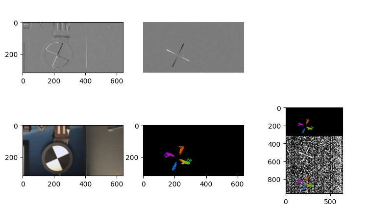

基于SpyNet的光流网络
====================

这个示例展示一个在AOP上运行的，推理快速的端到端光流网络
-------------------------------------------------------

调用接口： - tianmoucv.proc.opticalflow.TianmoucOF_SpyNet

.. code:: ipython3

    %load_ext autoreload

必要的库
--------

.. code:: ipython3

    %autoreload
    import sys,os, math,time
    import numpy as np
    import matplotlib.pyplot as plt
    import torch
    import torch.nn as nn
    from tianmoucv.data import TianmoucDataReader
    import torch.nn.functional as F
    import cv2

.. parsed-literal::

    TianMouCV™ 0.3.5.4, via Y. Lin  update new nn for reconstruction

准备数据
--------

.. code:: ipython3

    train='/data/lyh/tianmoucData/tianmoucReconDataset/train/'
    dirlist = os.listdir(train)
    traindata = [train + e for e in dirlist]
    
    val='/data/lyh/tianmoucData/tianmoucReconDataset/test/'
    vallist = os.listdir(val)
    valdata = [val + e for e in vallist]
    key_list = []
    print('---------------------------------------------------')
    for sampleset in traindata:
        print('---->',sampleset,'有：',len(os.listdir(sampleset)),'个样本')
        for e in os.listdir(sampleset):
            print(e,end=" ")
            key_list.append(e)
    print('---------------------------------------------------')
    for sampleset in valdata:
        print('---->',sampleset,'有：',len(os.listdir(sampleset)),'个样本')
        for e in os.listdir(sampleset):
            print(e,end=" ")
            key_list.append(e)
            
    all_data = valdata + traindata
    key_list = ['underbridge_hdr_4']

.. parsed-literal::

    ---------------------------------------------------
    ----> /data/lyh/tianmoucData/tianmoucReconDataset/train/normal 有： 67 个样本
    outdoor_cross_8 train_cross2 traffic5 indoor_office_2 train_indoor_dog4 outdoor_cross_5 indoor_office_6 train_running_man_5 indoor_office_1 train_exam_fan2 indoor_office_3 people1 train_exam_fan5 indoor_office_4 indoor_slefie_2 outdoor_cross_9 outdoor_bridge_1 outdoor_cross_4 outdoor_cross_1 outdoor_4huan traffic15 outdoor_cross_12 outdoor_bridge_2 traffic9 traffic2 traffic_nohdr_16 traffic11 train_exam_fan1 train_indoor_dog1 train_cross3 train_driving5 traffic7 traffic_nohdr_15 train_driving14 train_driving9 outdoor_cross_7 train_driving4 traffic10 train_running_man_6 train_exam_fan3 train_driving6 train_cross4 train_driving3 outdoor_cross_3 train_driving11 traffic14 outdoor_bz_1 outdoor_hutong_1 indoor_slefie_1 indoor_keyboard1 train_man_play_ball1 train_driving8 traffic3 train_driving7 outdoor_cross_11 train_exam_full4 train_running_man_7 people10 traffic6 train_driving13 traffic13 traffic_nohdr_17 train_driving10 train_exam_full2 train_indoor_dog2 traffic1 train_exam_full1 ----> /data/lyh/tianmoucData/tianmoucReconDataset/train/extreme 有： 51 个样本
    flicker_12 underbridge_hdr_4 hdr_people9 train_exam_flicker3 underbridge_hdr_2 hdr_traffic35 hdr_people15 flicker_3 hdr_people2 train_tunnel3_hdr_ae hdr_traffic18 shake2 indoor_crazy_shake flicker_1 flicker_8 hdr_traffic20 underbridge_hdr_1 hdr_traffic30 train_exam_flicker2 hdr_traffic19 flicker_17 flicker_6 shake5 hdr_traffic23 train_exam_flicker1 train_hdr_human hdr_people5 hdr_people3 flicker_0 hdr_people11 train_tunnel6_hdr_ae flicker_4 flicker_9 flicker_11 flicker_15 hdr_people7 shake4 hdr_traffic26 train_tunnel4_hdr_ae hdr_traffic25 hdr_traffic29 train_tunnel1_hdr_blur shake1 train_driving2 hdr_traffic22 train_exam_fan_QRcode_1 hdr_people6 flicker_14 hdr_traffic34 hdr_people14 train_tunnel5_hdr_ae ---------------------------------------------------
    ----> /data/lyh/tianmoucData/tianmoucReconDataset/test/normal 有： 24 个样本
    test_tunnel2 test_man_play_ball3 test_exam_fan4 test_driving24 test_driving3 test_driving20 indoor_office_5 outdoor_cross_10 test_running_man_8 test_cross3 outdoor_cross_13 outdoor_4huan_2 test_exam_full3 test_driving4 traffic4 test_driving12 test_driving16 outdoor_cross_6 traffic8 test_driving8 traffic12 outdoor_bridge_3 test_running_man_4 indoor_keyboard2 ----> /data/lyh/tianmoucData/tianmoucReconDataset/test/extreme 有： 30 个样本
    shake3 test_tunnel7_hdr_ae hdr_traffic36 test_exam_fan_QRcode_2 flicker_16 hdr_traffic21 hdr_traffic32 test_indoor_dog3 hdr_traffic24 train_exam_flicker5 hdr_people13 test_tunnel8_hdr_ae_double hdr_people8 flicker_13 hdr_traffic33 hdr_people4 test_exam_fan_QRcode_3 hdr_traffic31 indoor_selfie_shake_3 flicker_7 hdr_people16 flicker_10 flicker_2 hdr_people12 test_driving_night_light1 test_hdr_human2 underbridge_hdr_3 flicker_18 flicker_5 shake6 

光流网络初始化
--------------

.. code:: ipython3

    %autoreload
    from tianmoucv.proc.opticalflow import TianmoucOF_SpyNet
    
    local_rank = 0
    device = torch.device('cuda:'+str(local_rank))
    OFNet = TianmoucOF_SpyNet((320,640),_optim=False)
    OFNet.to(device)
    OFNet.eval()

.. parsed-literal::

    loading..: https://cloud.tsinghua.edu.cn/f/84ac6e32060443e2975d/?dl=1
    load finished

.. parsed-literal::

    TianmoucOF_SpyNet(
      (flowComp): SpyNet(
        (netBasic): ModuleList(
          (0-5): 6 x Basic_larger_kernel(
            (netBasic): Sequential(
              (0): Conv2d(7, 32, kernel_size=(7, 7), stride=(1, 1), padding=(3, 3))
              (1): ReLU()
              (2): Conv2d(32, 64, kernel_size=(7, 7), stride=(1, 1), padding=(3, 3))
              (3): ReLU()
              (4): Conv2d(64, 32, kernel_size=(7, 7), stride=(1, 1), padding=(3, 3))
              (5): ReLU()
              (6): Conv2d(32, 16, kernel_size=(5, 5), stride=(1, 1), padding=(2, 2))
              (7): ReLU()
              (8): Conv2d(16, 2, kernel_size=(5, 5), stride=(1, 1), padding=(2, 2))
            )
          )
        )
      )
    )

光流计算
-----------------------------------

.. code:: ipython3

    %autoreload
    from IPython.display import clear_output
    from tianmoucv.isp import *
    from tianmoucv.proc.opticalflow import interpolate_image,flow_to_image
    import time
    import cv2
    
    imlist = []
    noiseThresh = 0
    W = 640
    H = 320
    acctime= 1
    gridX, gridY = np.meshgrid(np.arange(W), np.arange(H))
    
    dataset = TianmoucDataReader(all_data,MAXLEN=400,matchkey = 'test_exam_fan4')
    
    show_list = []
    for index in range(len(dataset)):
        if index <=0:
            continue
        elif index > 10:
            break
        else:
            print('rpogress:',index,'/',len(dataset))
            sample = dataset[index]
            F0 = sample['F0']
            F1 = sample['F1']
            tsdiff = sample['tsdiff']
            F0show = F0.copy()
            show_img = F0show.copy()
            for b in range(25//acctime):
                SD0 = 0
                SD1 = 0
                Tdiff = 0
                            
                with torch.no_grad():
                    #print(tsdiff.shape)
                    rawflow = OFNet.forward_time_range(tsdiff.unsqueeze(0), t1=b*acctime, t2=(b+1)*acctime) #输出值0~1
                    rawflow = rawflow.cpu()
                    
                SD0 = tsdiff[1:,b*acctime,...].unsqueeze(0).to(device)
                SD1 = tsdiff[1:,(b+1)*acctime,...].unsqueeze(0).to(device)
                Tdiff= tsdiff[0:1,b*acctime:(b+1)*acctime,...].to(device)
                Tdiff = torch.sum(Tdiff,dim=1).unsqueeze(0)
                
                td = -tsdiff[0,(b+1)*acctime,...].to(device)
                tdiff_show = np.stack([td.cpu()*255]*3,axis=2).astype(np.uint8)
                tdiff_show[abs(tdiff_show)<8]=0
                
                Tdiff = F.interpolate(Tdiff,(320,640),mode='bilinear')
                SD0 = F.interpolate(SD0,(320,640),mode='bilinear')
                SD1 = F.interpolate(SD1,(320,640),mode='bilinear')
    
                
                u = rawflow[0,0:1,:, :]
                v = rawflow[0,1:2,:, :]
                flow_show = flow_to_image(rawflow[0,...].permute(1,2,0).numpy())
                flow_show = torch.Tensor(cv2.resize(flow_show,(640,320)))/255.0
                flow_show = (flow_show*255).numpy().astype(np.uint8)
                
                mask = np.mean(flow_show,axis=-1) > 225
                flow_show[np.stack([mask]*3,axis=-1)]=0
                
                show_img = interpolate_image(show_img,u,v)
                sparsity = 8
                scale = 10
                for w in range(640//sparsity):
                    for h in range(320//sparsity):
                        x = int(w*sparsity)
                        y = int(h*sparsity)
                        u_ij = -u[0,y,x]
                        v_ij = -v[0,y,x]
                        color = flow_show[y,x,:]
                        color = tuple([int(e+20) for e in color])
                        if (u_ij**2+v_ij**2)>5:
                            cv2.arrowedLine(flow_show, (x,y), (int(x+u_ij*scale),int(y+v_ij*scale)), color,2, tipLength=0.15)
                
                tdiff_show_tensor = torch.Tensor(tdiff_show.copy())
                flow_show_tensor = torch.Tensor(flow_show)
                mask = torch.stack([torch.mean(flow_show_tensor,dim=-1)>0]*3,dim=-1)
                tdiff_show_tensor[mask] = flow_show_tensor[mask]/255.0
                tdiff_show_merge = tdiff_show_tensor.numpy()
                imshow = np.concatenate([flow_show/255.0,tdiff_show,tdiff_show_merge],axis=0)
                show_list.append(imshow)
                
                if b%10==0:
                    clear_output()
                    plt.figure(figsize=(9,5))
                    plt.axis('off') 
                    plt.subplot(2,3,1)
                    plt.imshow(SD0[0,0,...].cpu(),cmap='gray')
                    plt.subplot(2,3,2)
                    plt.imshow(Tdiff[0,0,...].cpu(),cmap='gray')
                    plt.axis('off') 
                    plt.subplot(2,3,4)
                    plt.imshow(F0show)
                    plt.subplot(2,3,5)
                    plt.imshow(flow_show/255.0)
                    plt.subplot(2,3,6)
                    plt.imshow(imshow)
                    plt.show()

.. parsed-literal::

    Clipping input data to the valid range for imshow with RGB data ([0..1] for floats or [0..255] for integers).

.. parsed-literal::

    300.25799985682585 fps
    293.3489998601203 fps
    290.2030028367813 fps
    288.6055184751944 fps

导出视频
--------

.. code:: ipython3

    def images_to_video(frame_list,name,Val_size=(512,256),Flip=False):
        fps = 30         
        size = (Val_size[0], Val_size[1]) # 需要转为视频的图片的尺寸
        out = cv2.VideoWriter(name,0x7634706d , fps, size)
        count = 0
        for frame in frame_list:
            count += 1
            frame *= 255
            frame = frame.astype(np.uint8)
            out.write(frame)
        out.release()
        
    images_to_video(show_list,'./spynet_tianmouc_of_multiple_scale_nn.mp4',Val_size=(640,320*3),Flip=False)

.. parsed-literal::

    /tmp/ipykernel_48437/3373490870.py:9: RuntimeWarning: invalid value encountered in cast
      frame = frame.astype(np.uint8)

