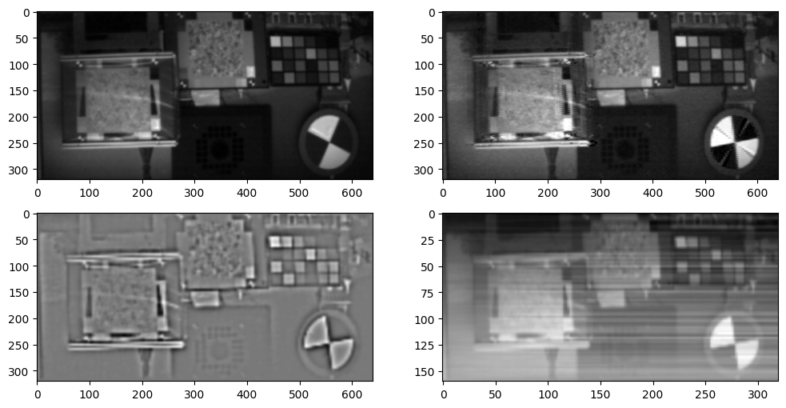

基于AOP的灰度重建
=================

这个示例展示如何使用AOP中的数据直接做灰度重建
---------------------------------------------

调用接口： - tianmoucv.proc.reconstruct.TD_integration -
tianmoucv.proc.reconstruct.SD_integration - tianmoucv.isp.SD2XY

.. code:: ipython3

    %load_ext autoreload

引入必要的库
------------

.. code:: ipython3

    %autoreload
    from IPython.display import clear_output
    import sys,time,cv2,torch,os,random,argparse
    import matplotlib.pyplot as plt
    import torch.nn as nn
    import torch.nn.functional as F
    import numpy as np
    import math
    
    from tianmoucv.proc.reconstruct import TD_integration,SD_integration
    from tianmoucv.isp import lyncam_raw_comp,demosaicing_npy,vizDiff
    from tianmoucv.data import TianmoucDataReader
    from tianmoucv.isp import SD2XY
    from tianmoucv.proc.reconstruct import laplacian_blending
    
    def images_to_video(frame_list,name,size=(640,320),Flip=True):
        fps = 60        
        ftmax = max([np.max(ft) for ft in frame_list])
        ftmin = min([np.min(ft) for ft in frame_list])
        out = cv2.VideoWriter(name,0x7634706d , fps, size)
        for ft in frame_list:
            ft = (ft-ftmin)/(ftmax-ftmin)
            ft2 = (ft*255).astype(np.uint8)
            out.write(ft2)
        out.release()

.. parsed-literal::

    TianMouCV™ 0.3.5.4, via Y. Lin  update new nn for reconstruction

准备数据
--------

.. code:: ipython3

    train='/data/lyh/tianmoucData/tianmoucReconDataset/train/'
    dirlist = os.listdir(train)
    traindata = [train + e for e in dirlist]
    val='/data/lyh/tianmoucData/tianmoucReconDataset/test/'
    vallist = os.listdir(val)
    valdata = [val + e for e in vallist]
    
    key_list = [] #包含所有sample名作为匹配关键词
    for sampleset in valdata:
        print(' ')
        print('---->',sampleset,'有：',len(os.listdir(sampleset)),'个样本--------------------')
        for e in os.listdir(sampleset):
            print(e,end=" ")
            key_list.append(e)
    for sampleset in traindata:
        print(' ')
        print('---->',sampleset,'有：',len(os.listdir(sampleset)),'个样本--------------------')
        for e in os.listdir(sampleset):
            print(e,end=" ")
            key_list.append(e)     
            
    all_data = valdata + traindata #包含所有数据的父路径的列表

.. parsed-literal::

     
    ----> /data/lyh/tianmoucData/tianmoucReconDataset/test/normal 有： 24 个样本--------------------
    test_tunnel2 test_man_play_ball3 test_exam_fan4 test_driving24 test_driving3 test_driving20 indoor_office_5 outdoor_cross_10 test_running_man_8 test_cross3 outdoor_cross_13 outdoor_4huan_2 test_exam_full3 test_driving4 traffic4 test_driving12 test_driving16 outdoor_cross_6 traffic8 test_driving8 traffic12 outdoor_bridge_3 test_running_man_4 indoor_keyboard2  
    ----> /data/lyh/tianmoucData/tianmoucReconDataset/test/extreme 有： 30 个样本--------------------
    shake3 test_tunnel7_hdr_ae hdr_traffic36 test_exam_fan_QRcode_2 flicker_16 hdr_traffic21 hdr_traffic32 test_indoor_dog3 hdr_traffic24 train_exam_flicker5 hdr_people13 test_tunnel8_hdr_ae_double hdr_people8 flicker_13 hdr_traffic33 hdr_people4 test_exam_fan_QRcode_3 hdr_traffic31 indoor_selfie_shake_3 flicker_7 hdr_people16 flicker_10 flicker_2 hdr_people12 test_driving_night_light1 test_hdr_human2 underbridge_hdr_3 flicker_18 flicker_5 shake6  
    ----> /data/lyh/tianmoucData/tianmoucReconDataset/train/normal 有： 67 个样本--------------------
    outdoor_cross_8 train_cross2 traffic5 indoor_office_2 train_indoor_dog4 outdoor_cross_5 indoor_office_6 train_running_man_5 indoor_office_1 train_exam_fan2 indoor_office_3 people1 train_exam_fan5 indoor_office_4 indoor_slefie_2 outdoor_cross_9 outdoor_bridge_1 outdoor_cross_4 outdoor_cross_1 outdoor_4huan traffic15 outdoor_cross_12 outdoor_bridge_2 traffic9 traffic2 traffic_nohdr_16 traffic11 train_exam_fan1 train_indoor_dog1 train_cross3 train_driving5 traffic7 traffic_nohdr_15 train_driving14 train_driving9 outdoor_cross_7 train_driving4 traffic10 train_running_man_6 train_exam_fan3 train_driving6 train_cross4 train_driving3 outdoor_cross_3 train_driving11 traffic14 outdoor_bz_1 outdoor_hutong_1 indoor_slefie_1 indoor_keyboard1 train_man_play_ball1 train_driving8 traffic3 train_driving7 outdoor_cross_11 train_exam_full4 train_running_man_7 people10 traffic6 train_driving13 traffic13 traffic_nohdr_17 train_driving10 train_exam_full2 train_indoor_dog2 traffic1 train_exam_full1  
    ----> /data/lyh/tianmoucData/tianmoucReconDataset/train/extreme 有： 51 个样本--------------------
    flicker_12 underbridge_hdr_4 hdr_people9 train_exam_flicker3 underbridge_hdr_2 hdr_traffic35 hdr_people15 flicker_3 hdr_people2 train_tunnel3_hdr_ae hdr_traffic18 shake2 indoor_crazy_shake flicker_1 flicker_8 hdr_traffic20 underbridge_hdr_1 hdr_traffic30 train_exam_flicker2 hdr_traffic19 flicker_17 flicker_6 shake5 hdr_traffic23 train_exam_flicker1 train_hdr_human hdr_people5 hdr_people3 flicker_0 hdr_people11 train_tunnel6_hdr_ae flicker_4 flicker_9 flicker_11 flicker_15 hdr_people7 shake4 hdr_traffic26 train_tunnel4_hdr_ae hdr_traffic25 hdr_traffic29 train_tunnel1_hdr_blur shake1 train_driving2 hdr_traffic22 train_exam_fan_QRcode_1 hdr_people6 flicker_14 hdr_traffic34 hdr_people14 train_tunnel5_hdr_ae 

读取数据，分别用3种不同的方法重建灰度图
---------------------------------------

.. code:: ipython3

    %autoreload
    from IPython.display import clear_output
    
    MSE_LossFn = nn.MSELoss()
    speedUpRate = 1
    psnrcount =0
    count = 0
    
    for key in ['train_exam_full1']:
        dataset = TianmoucDataReader(all_data,MAXLEN=500*speedUpRate,matchkey=key,speedUpRate=speedUpRate)
        dataLoader = torch.utils.data.DataLoader(dataset, batch_size=1,\
                                              num_workers=4, pin_memory=False, drop_last = False)
    
        PSNR = 0
        img_list = []
        for index,sample in enumerate(dataLoader,0):
            if index<0:
                continue
            if index<= 20:
                psnrcount += 1
                F0 = sample['F0_HDR'][0,...]
                F1 = sample['F1_HDR'][0,...]
                gray1 = torch.mean(F1,dim=-1)
                gray0 = torch.mean(F0,dim=-1)
    
                for t in range(sample['rawDiff'].size(2)):
    
                    tsdiff = sample['rawDiff'][0,...]/255.0
    
                    # TD积分
                    hdr = TD_integration(tsdiff,F0,F1,t,threshGate=0/255.0)
                    hdr = hdr.numpy()
                    hdr_show = np.stack([hdr]*3,axis=-1)                
                    SD = tsdiff[1:,t,...].permute(1,2,0)
                    Ix,Iy= SD2XY(SD)
                    gray = laplacian_blending(-Ix,-Iy,iteration=20)
                    gray_laplac = F.interpolate(torch.Tensor(gray).unsqueeze(0).unsqueeze(0), size=(320,640), mode='bilinear').squeeze(0).squeeze(0)
    
                    # SD积分
                    gray_direct = SD_integration(Ix,Iy)
                    if t==12:
                        clear_output()
                        plt.figure(figsize=(12,6))
                        plt.subplot(2,2,1)  
                        plt.imshow(gray0,cmap='gray')
                        plt.subplot(2,2,2)  
                        plt.imshow(hdr_show)
                        plt.subplot(2,2,3)  
                        plt.imshow(gray_laplac,cmap='gray')
                        plt.subplot(2,2,4)  
                        plt.imshow(gray_direct,cmap='gray')
                        plt.show()
                        
                    if t==25:
                        MSE_val = MSE_LossFn(torch.Tensor(hdr), gray1) 
                        PSNR += (10 * math.log10(1 / MSE_val.item()))
                        print("PSNR:",PSNR/psnrcount,'dB')
                    img_list.append(hdr_show)
            else:
                break

.. parsed-literal::

    Clipping input data to the valid range for imshow with RGB data ([0..1] for floats or [0..255] for integers).

.. parsed-literal::

    PSNR: 31.86600562321633 dB

.. code:: ipython3

    images_to_video(img_list,'./gray_recon.mp4')

